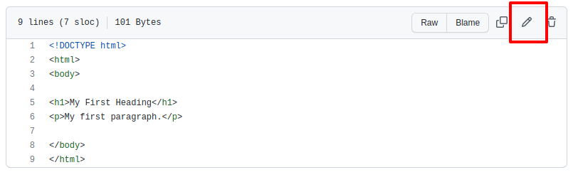
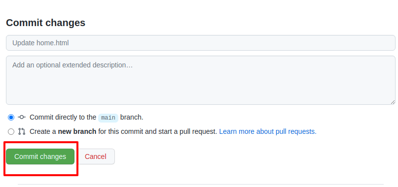

### Zadanie

Utwórz repozytorium na dysku za pomocą komendy **git init**.
Utwórz plik o nazwie `sample.html`.

Utwórz **branch first** i się na niego przełącz.
Dodaj do pliku zawartość:

```html<h1>This is heading 1</h1>
<h2>This is heading 2</h2>
<h3>This is heading 3</h3>
<h4>This is heading 4</h4>
<h5>This is heading 5</h5>
<h6>This is heading 6</h6>
```

Zrób **commit**, następnie przełącz się na **branch master**.
Dodaj do pliku sample.html poniższą zawartość.
```html<p>This is some text in a paragraph.</p>
<p>This is some text in a paragraph.</p>
<p>This is some text in a paragraph.</p>
<p>This is some text in a paragraph.</p>
<p>This is some text in a paragraph.</p>
```
Zrób **commit** wprowadzonych zmian.

Zrób **merge** "brancha" **first** do **develop**.

Rozwiąż zaistniały konflikt.


### Zadanie

Utwórz repozytorium w serwisie **GitHub** o nazwie **Break1Exercise2**.
Pobierz repozytorium lokalnie.
Dodaj plik **home.html** dodaj w nim zawartość:
```html
<!DOCTYPE html>
<html>
<body>

<h1>My First Heading</h1>
<p>My first paragraph.</p>

</body>
</html>
```
Dodaj plik do poczekalni, zrób commit, a następnie push.

Zmodyfikuj paragram na następujący:
```html
<p>My first paragraph - update.</p>
```
Całość pliku powinna wyglądać następująco:
```html
<!DOCTYPE html>
<html>
<body>

<h1>My First Heading</h1>
<p>My first paragraph - update.</p>

</body>
</html>
```
Dodaj plik do poczekalni i wykonaj commit:
```
git add home.html 
git commit -m "change paragraph"
```
Następnie przejść do repozytorium na **github.com**, wyświetl plik **home.html** i wykonaj ręcznej edycji pliku.
Służy do tego ikona ołówka:


Zmodyfikuj ten sam paragraf wstawiając zawartość:
```html
<p>Another update.</p>
```
Nastepnie za poomcą **github.com** wykonaj commit:



Ostatnim krokiem przygotowawczym jest wykonanie:
```git pull```.
Po tej operacji w konsoli otrzymamy komunikat:
```bash
Auto-merging home.html
CONFLICT (content): Merge conflict in home.html
Automatic merge failed; fix conflicts and then commit the result.
```
Wystąpił konflikt, plik będzie wyglądał następująco:
```html
<!DOCTYPE html>
<html>
<body>

<h1>My First Heading</h1>
<<<<<<< HEAD
<p>My first paragraph - update.</p>
=======
<p>Another update.</p>
>>>>>>> 6b69fe51b66fcb38b18098659b5c31dbf4d8cae0

</body>
</html>
```
Rozwiąż powstały konflikt, zatwierdzając poniższą zawartość paragrafu:
```
<p>My first paragraph - update.</p>
```
